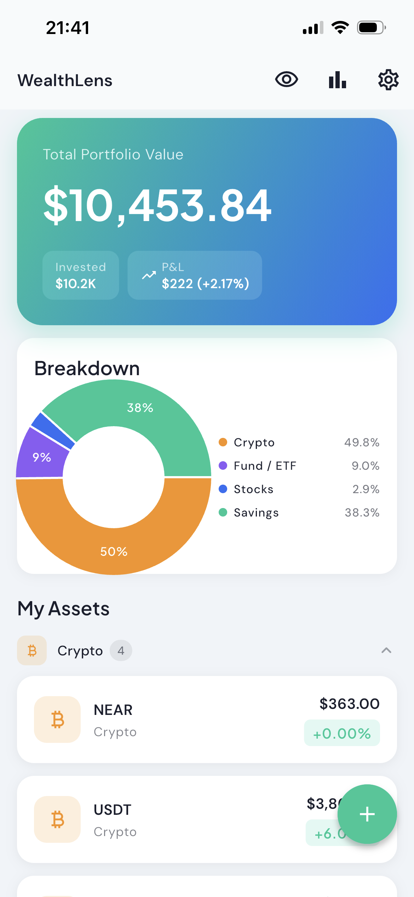
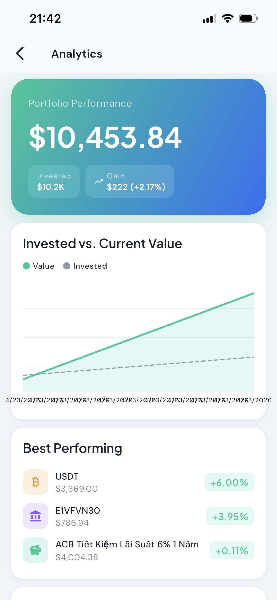
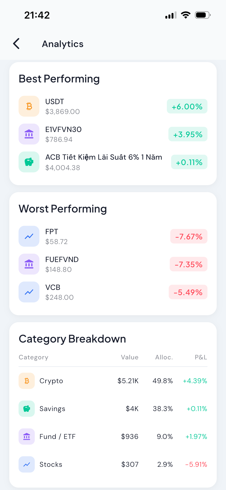
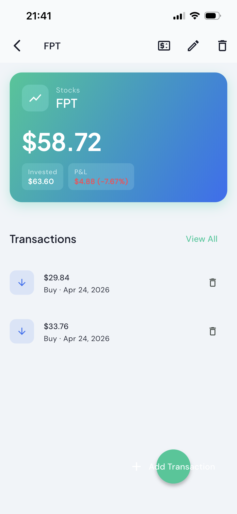
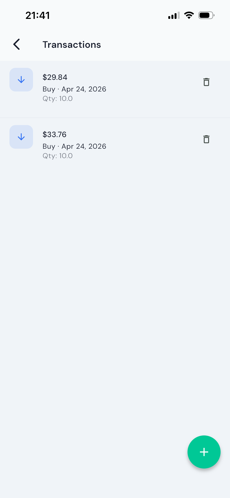
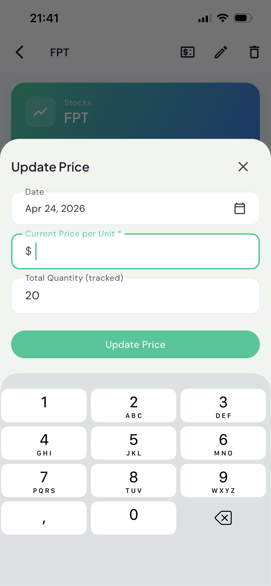
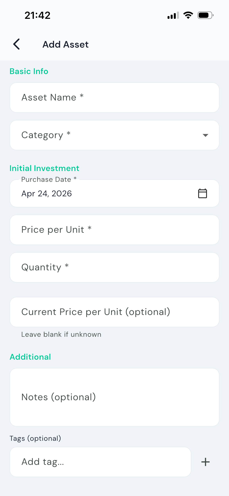
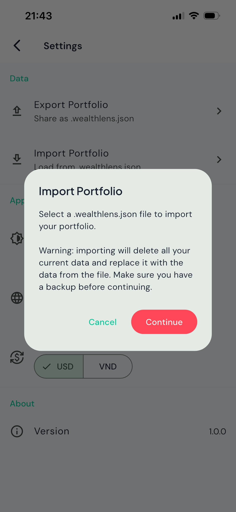
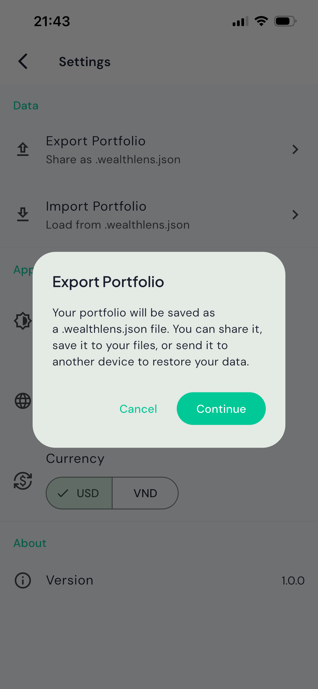
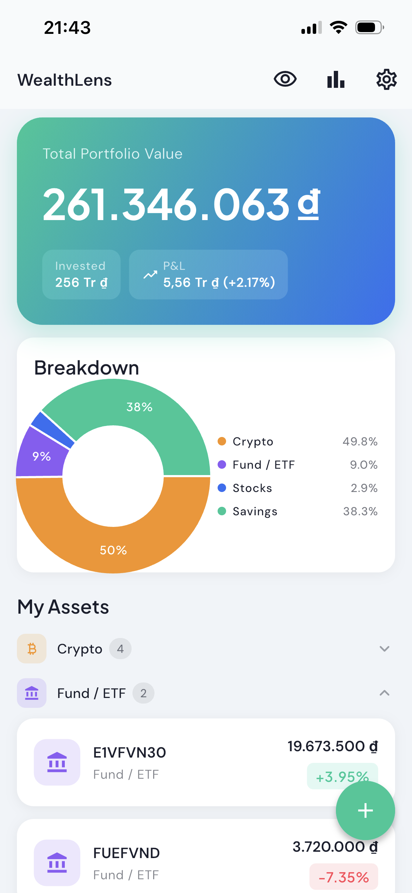

<div align="center">

# 💰 WealthLens

**Track all your investments in one place — privately, on your device.**

[](https://flutter.dev)
[](https://flutter.dev)

[English](#english) · [Tiếng Việt](#tiếng-việt)

</div>

---

<a name="english"></a>

## 🇬🇧 English

### What is WealthLens?

WealthLens is a personal investment portfolio tracker that runs entirely on your device — no accounts, no cloud, no tracking. You own your data.

Track crypto, stocks, mutual funds, gold, real estate, savings, loans, and more. See your total portfolio value, profit/loss breakdown, and asset allocation at a glance.

---

### Screenshots

<table>
  <tr>
    <td align="center"><b>Dashboard</b></td>
    <td align="center"><b>Analytics Overview</b></td>
    <td align="center"><b>Analytics Breakdown</b></td>
  </tr>
  <tr>
    <td></td>
    <td></td>
    <td></td>
  </tr>
  <tr>
    <td align="center"><b>Asset Detail</b></td>
    <td align="center"><b>Transactions</b></td>
    <td align="center"><b>Update Price</b></td>
  </tr>
  <tr>
    <td></td>
    <td></td>
    <td></td>
  </tr>
  <tr>
    <td align="center"><b>Add Asset</b></td>
    <td align="center"><b>Export</b></td>
    <td align="center"><b>Import</b></td>
  </tr>
  <tr>
    <td></td>
    <td></td>
    <td></td>
  </tr>
</table>

> 📁 Place your screenshots in the `screenshots/` folder with the filenames above. Both English and Vietnamese screenshots are supported.

---

### Features

#### 📊 Dashboard
The main screen gives you a complete picture of your portfolio at a glance:

- **Total portfolio value** with a smooth animated counter
- **Invested amount** and **Profit/Loss** (absolute value + percentage), color-coded green/red
- **Donut chart** breaking down your allocation by category — only shown when you have 2+ assets
- **Asset list** grouped by category; groups with multiple assets can be collapsed for a cleaner view
- **Swipe left** on any asset card to instantly update its price (blue panel)
- **Swipe right** on any asset card to delete it (red panel)
- Tap the **eye icon** to hide all monetary values for privacy

#### 📈 Analytics
Deep-dive into your portfolio performance:

- **Portfolio Performance** timeline chart comparing current value (solid line) vs. total invested (dashed line)
- **Best Performing** assets ranked by P&L%
- **Worst Performing** assets ranked by P&L%
- **Category Breakdown** table showing value, allocation %, and P&L% per category

#### 🏦 Asset Management
Add and track any type of investment:

| Category | Examples |
|---|---|
| 🪙 Cryptocurrency | BTC, ETH, NEAR, USDT |
| 📈 Stocks | FPT, VCB, AAPL |
| 🏛️ Mutual Fund / ETF | E1VFVN30, FUEFVND |
| 🥇 Gold | SJC, DOJI |
| 🏠 Real Estate | Land, apartments |
| 🐷 Savings / Deposit | Term deposits, savings accounts |
| 🤝 Peer Lending | Personal loans to friends/family |
| 📦 Other | Anything else |

Each asset stores:
- Name and category
- Full transaction history (buys, sells, updates)
- Price history used to draw the value chart
- Optional notes and tags

#### 💳 Transactions
Every asset has a full transaction history:

- **Buy** — record a purchase with price per unit, quantity, and date. The invested amount grows.
- **Sell** — record a sale; the current value decreases automatically.
- **Update** — log a standalone valuation without affecting your invested amount.

Quantity fields support decimal input (e.g. `0.001` BTC, `1.5` gold units). On Vietnamese keyboards where the decimal key outputs `,`, it is automatically normalised to `.`.

#### 💲 Update Price
Quickly refresh an asset's current value without creating a buy/sell transaction:

- **Assets with quantity tracking** (stocks, crypto): enter the new price per unit → the total value is calculated automatically with a live preview below the field
- **Other assets** (savings, real estate, gold): enter the total value directly

Access it from:
- **Left swipe** on any asset card in the Dashboard
- The **$** icon in the Asset Detail AppBar

#### 🙈 Hide / Show Balances
Tap the **eye icon** in the Dashboard AppBar to hide all monetary values across every screen (Dashboard, Asset Detail, Analytics, Transactions). Shown as `•••`. Useful in public places.

#### 🌍 Multi-language & Currency
- **Languages**: English and Vietnamese (switch instantly in Settings)
- **Currencies**: USD ($) and VND (₫)
- All values are stored internally in USD; a configurable exchange rate is used for VND display
- Vietnamese characters in asset names and notes are fully preserved

#### 📤 Export & Import
Back up and restore your entire portfolio:

- **Export** — saves a `.wealthlens.json` file that you can share to Files, email, iCloud, Google Drive, or any other app
- **Import** — loads a previously exported file. A warning is shown before the file picker opens, because importing **replaces all current data**

The JSON file is human-readable and fully UTF-8 encoded, so Vietnamese names and notes round-trip correctly.

---

### How to Use

#### Adding your first asset
1. Tap **+** on the Dashboard
2. Enter the asset name and select a category
3. Fill in the purchase date, price per unit, and quantity
4. Optionally enter the **Current Price per Unit** if the price has changed since you bought it — this sets your starting price history point
5. Add notes or tags for easy reference later
6. Tap **Save**

#### Updating an asset's current price
1. From the Dashboard, **swipe left** on the asset card → tap the blue price icon
   — or open the asset and tap the **$** icon in the top-right corner
2. For quantity-tracked assets (stocks, crypto): enter the current price per unit → the app calculates the new total value and shows a preview
3. For other assets: enter the new total value directly
4. Tap **Update Price**

#### Recording a buy / sell transaction
1. Open the asset detail screen and tap **Add Transaction** (FAB at the bottom right)
2. Select **Buy** or **Sell** using the toggle at the top
3. Enter price per unit, quantity, and optionally a note
4. Tap **Add Transaction**

The asset's current value and P&L are updated immediately.

#### Backing up and restoring your data
- **Backup**: Settings → Export Portfolio → Continue → choose where to save the file
- **Restore**: Settings → Import Portfolio → Continue → select your `.wealthlens.json` file

> ⚠️ Importing replaces all current data. Export first if you want to keep a backup.

---

### Privacy

All data is stored locally on your device using [Hive](https://github.com/hivedb/hive) — a lightweight, encrypted-ready key-value database. There are **no network requests, no analytics, no accounts, and no ads**.

---

<a name="tiếng-việt"></a>

---

## 🇻🇳 Tiếng Việt

### WealthLens là gì?

WealthLens là ứng dụng theo dõi danh mục đầu tư cá nhân, hoạt động hoàn toàn trên thiết bị của bạn — không cần tài khoản, không cloud, không theo dõi dữ liệu. Dữ liệu thuộc về bạn.

Theo dõi tiền mã hóa, cổ phiếu, chứng chỉ quỹ, vàng, bất động sản, tiết kiệm, cho vay và nhiều hơn nữa. Xem tổng giá trị danh mục, lợi nhuận/lỗ và phân bổ tài sản chỉ trong một cái nhìn.

---

### Ảnh minh họa

<table>
  <tr>
    <td align="center"><b>Tổng quan</b></td>
    <td align="center"><b>Phân tích – Biểu đồ</b></td>
    <td align="center"><b>Phân tích – Bảng</b></td>
  </tr>
  <tr>
    <td></td>
    <td></td>
    <td></td>
  </tr>
  <tr>
    <td align="center"><b>Chi tiết tài sản</b></td>
    <td align="center"><b>Lịch sử giao dịch</b></td>
    <td align="center"><b>Cập nhật giá</b></td>
  </tr>
  <tr>
    <td></td>
    <td></td>
    <td></td>
  </tr>
  <tr>
    <td align="center"><b>Thêm tài sản</b></td>
    <td align="center"><b>Xuất danh mục</b></td>
    <td align="center"><b>Nhập danh mục</b></td>
  </tr>
  <tr>
    <td></td>
    <td></td>
    <td></td>
  </tr>
</table>

> 📁 Đặt ảnh chụp màn hình vào thư mục `screenshots/` với tên file như trên để ảnh hiển thị trong tài liệu này.

---

### Tính năng

#### 📊 Tổng quan (Dashboard)
Màn hình chính cung cấp cái nhìn toàn cảnh về danh mục đầu tư:

- **Tổng giá trị danh mục** với hiệu ứng đếm số mượt mà
- **Tổng đầu tư** và **Lợi nhuận/Lỗ** (giá trị tuyệt đối + phần trăm), màu xanh/đỏ
- **Biểu đồ tròn** thể hiện tỷ trọng phân bổ theo danh mục — chỉ hiện khi có từ 2 tài sản trở lên
- **Danh sách tài sản** nhóm theo danh mục; nhóm có nhiều tài sản có thể thu gọn để xem gọn hơn
- **Vuốt trái** thẻ tài sản để cập nhật giá nhanh (vùng màu xanh)
- **Vuốt phải** thẻ tài sản để xóa (vùng màu đỏ)
- Nhấn **biểu tượng mắt** để ẩn toàn bộ số tiền khi cần riêng tư

#### 📈 Phân tích (Analytics)
Phân tích chuyên sâu hiệu suất danh mục:

- **Biểu đồ hiệu suất danh mục** so sánh giá trị hiện tại (đường liền) với vốn đầu tư (đường nét đứt) theo thời gian
- **Hiệu suất tốt nhất** — xếp hạng các tài sản theo lợi nhuận %
- **Hiệu suất kém nhất** — xếp hạng các tài sản theo lỗ %
- **Bảng phân tích theo danh mục** — giá trị, tỷ trọng %, và lợi nhuận/lỗ % mỗi nhóm

#### 🏦 Quản lý tài sản
Thêm và theo dõi mọi loại đầu tư:

| Danh mục | Ví dụ |
|---|---|
| 🪙 Tiền mã hóa | BTC, ETH, NEAR, USDT |
| 📈 Cổ phiếu | FPT, VCB, ACB |
| 🏛️ Chứng chỉ quỹ / ETF | E1VFVN30, FUEFVND |
| 🥇 Vàng | SJC, DOJI |
| 🏠 Bất động sản | Đất, căn hộ |
| 🐷 Tiết kiệm / Gửi ngân hàng | Tiết kiệm có kỳ hạn |
| 🤝 Cho vay | Cho bạn bè/người thân vay |
| 📦 Khác | Bất kỳ tài sản nào khác |

Mỗi tài sản lưu trữ:
- Tên và danh mục
- Toàn bộ lịch sử giao dịch (mua, bán, cập nhật)
- Lịch sử giá dùng để vẽ biểu đồ giá trị
- Ghi chú và thẻ tùy chọn

#### 💳 Giao dịch
Mỗi tài sản có lịch sử giao dịch đầy đủ:

- **Mua** — ghi nhận giao dịch mua với giá, số lượng và ngày. Tổng đầu tư tăng lên.
- **Bán** — ghi nhận giao dịch bán; giá trị hiện tại giảm tự động.
- **Cập nhật** — ghi nhận điều chỉnh định giá mà không ảnh hưởng đến vốn đầu tư.

Trường số lượng hỗ trợ nhập số thập phân (ví dụ `0,001` BTC, `1,5` đơn vị vàng). Với bàn phím tiếng Việt sử dụng dấu phẩy làm dấu thập phân, ứng dụng tự động chuyển đổi sang dấu chấm.

#### 💲 Cập nhật giá
Làm mới giá trị hiện tại của tài sản mà không cần tạo giao dịch mua/bán:

- **Tài sản có theo dõi số lượng** (cổ phiếu, crypto): nhập giá mới mỗi đơn vị → tổng giá trị được tính tự động, hiển thị xem trước ngay bên dưới
- **Tài sản khác** (tiết kiệm, bất động sản, vàng): nhập trực tiếp tổng giá trị mới

Truy cập từ:
- **Vuốt trái** thẻ tài sản trên màn hình Tổng quan → nhấn biểu tượng giá màu xanh
- Biểu tượng **$** trên AppBar của trang Chi tiết tài sản

#### 🙈 Ẩn / Hiện số dư
Nhấn **biểu tượng mắt** trên AppBar để ẩn toàn bộ giá trị tiền tệ trên mọi màn hình (Tổng quan, Chi tiết tài sản, Phân tích, Giao dịch). Các số hiển thị thành `•••`. Tiện lợi khi dùng ở nơi công cộng.

#### 🌍 Đa ngôn ngữ & Tiền tệ
- **Ngôn ngữ**: Tiếng Anh và Tiếng Việt (chuyển đổi ngay trong Cài đặt)
- **Tiền tệ**: USD ($) và VND (₫)
- Toàn bộ giá trị lưu nội bộ bằng USD; tỷ giá hối đoái cấu hình trong Cài đặt dùng để hiển thị VND
- Ký tự tiếng Việt trong tên tài sản và ghi chú được bảo toàn hoàn toàn

#### 📤 Xuất & Nhập dữ liệu
Sao lưu và khôi phục toàn bộ danh mục đầu tư:

- **Xuất** — lưu file `.wealthlens.json` rồi chia sẻ qua Files, email, iCloud, Google Drive…
- **Nhập** — tải file đã xuất trước đó. Một cảnh báo hiện ra trước khi mở bộ chọn file, vì nhập dữ liệu sẽ **xóa toàn bộ dữ liệu hiện tại**

File JSON dễ đọc và mã hóa UTF-8 đầy đủ, đảm bảo tên và ghi chú tiếng Việt không bị lỗi khi xuất/nhập.

---

### Hướng dẫn sử dụng

#### Thêm tài sản đầu tiên
1. Nhấn **+** trên màn hình Tổng quan
2. Nhập tên tài sản và chọn danh mục
3. Điền ngày mua, giá mỗi đơn vị và số lượng
4. Tùy chọn: nhập **Giá hiện tại mỗi đơn vị** nếu giá đã thay đổi kể từ lúc mua — đây sẽ là điểm đầu tiên trong lịch sử giá
5. Thêm ghi chú hoặc thẻ để tiện tra cứu sau
6. Nhấn **Lưu**

#### Cập nhật giá tài sản
1. Từ màn hình Tổng quan, **vuốt trái** thẻ tài sản → nhấn biểu tượng giá màu xanh
   — hoặc mở trang Chi tiết tài sản → nhấn biểu tượng **$** góc trên bên phải
2. Với tài sản có theo dõi số lượng (cổ phiếu, crypto): nhập giá mỗi đơn vị hiện tại → ứng dụng tính và hiển thị xem trước tổng giá trị mới
3. Với tài sản khác: nhập thẳng tổng giá trị mới
4. Nhấn **Cập nhật giá**

#### Ghi nhận giao dịch mua / bán
1. Mở trang Chi tiết tài sản → nhấn **Thêm giao dịch** (nút tròn góc dưới phải)
2. Chọn **Mua** hoặc **Bán** bằng thanh chuyển đổi ở trên cùng
3. Nhập giá mỗi đơn vị, số lượng và tùy chọn ghi chú
4. Nhấn **Thêm giao dịch**

Giá trị hiện tại và lợi nhuận/lỗ được cập nhật ngay lập tức.

#### Sao lưu và khôi phục dữ liệu
- **Sao lưu**: Cài đặt → Xuất danh mục → Tiếp tục → chọn nơi lưu file
- **Khôi phục**: Cài đặt → Nhập danh mục → Tiếp tục → chọn file `.wealthlens.json`

> ⚠️ Nhập dữ liệu sẽ xóa toàn bộ dữ liệu hiện tại. Hãy xuất trước nếu bạn muốn giữ bản sao lưu.

---

### Quyền riêng tư

Toàn bộ dữ liệu được lưu trữ cục bộ trên thiết bị của bạn bằng [Hive](https://github.com/hivedb/hive) — cơ sở dữ liệu key-value nhẹ và nhanh. **Không có kết nối mạng, không phân tích dữ liệu, không tài khoản, không quảng cáo.**

---

## Tech Stack

| Concern | Library |
|---|---|
| Framework | Flutter 3.41.7 (iOS + Android) |
| Architecture | Clean Architecture (Domain / Data / Presentation) |
| State management | flutter_bloc + Cubit |
| Local database | Hive v2 |
| Navigation | GoRouter |
| Charts | fl_chart |
| Dependency injection | get_it + injectable |
| Serialization | freezed + json_serializable |
| Error handling | fpdart (`Either<Failure, Success>`) |
| Fonts | Plus Jakarta Sans + DM Sans (Google Fonts) |
| Localization | Flutter intl (ARB files — EN + VI) |
| Export / Import | path_provider + share_plus + file_picker |
| Animations | flutter_staggered_animations |

---

## Getting Started

```bash
# Install dependencies
flutter pub get

# Regenerate code (models, DI, l10n)
dart run build_runner build --delete-conflicting-outputs
flutter gen-l10n

# Run on connected device
flutter run
```

---

<div align="center">

Made with ❤️ using Flutter

</div>
